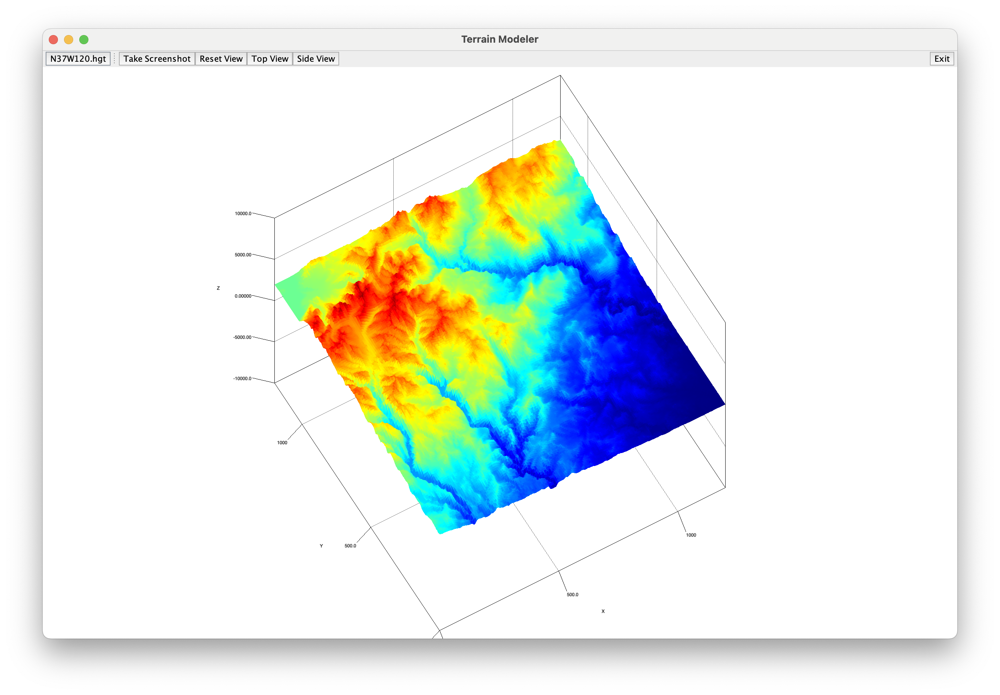
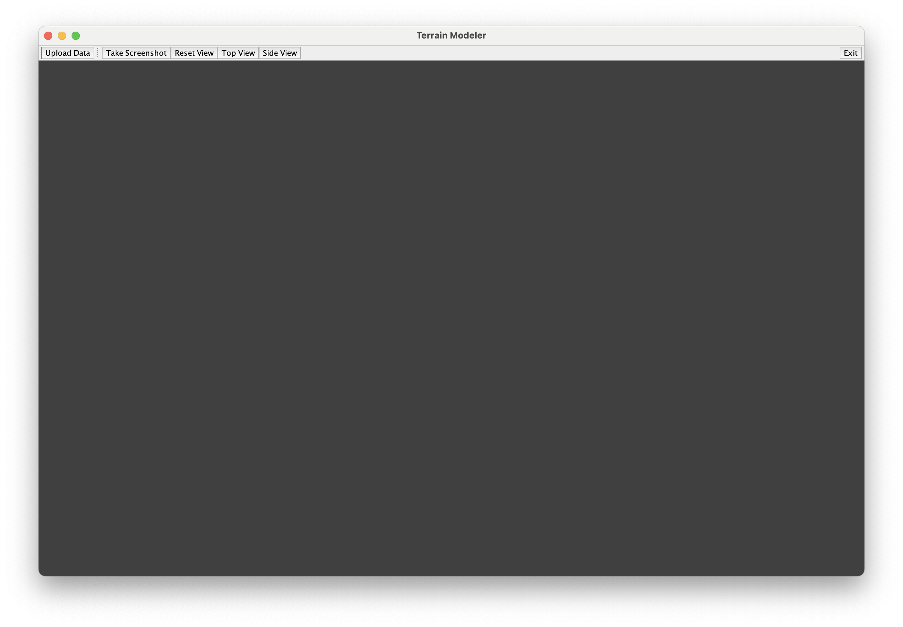
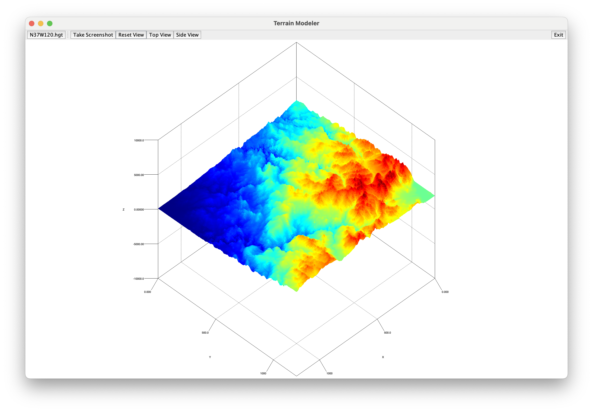
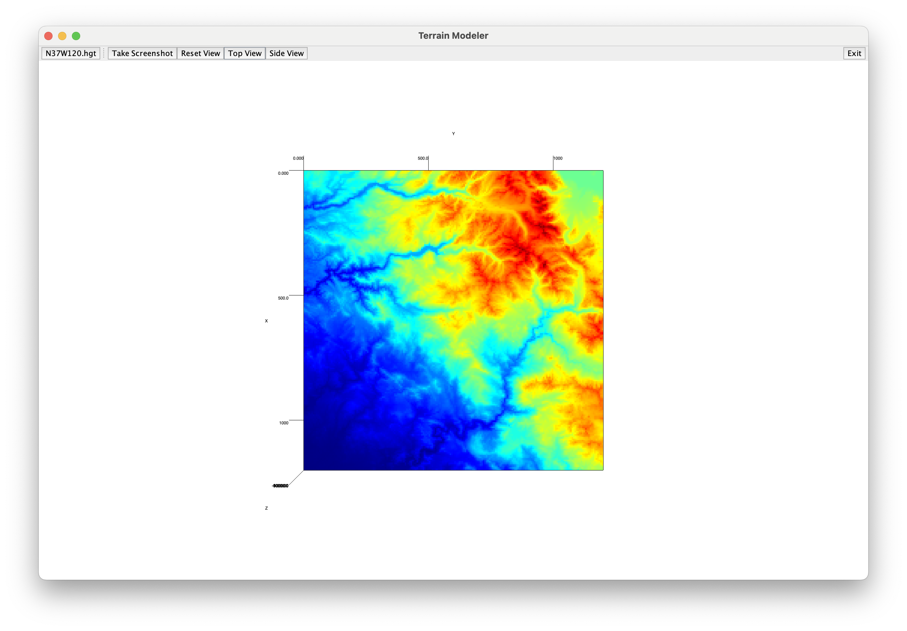
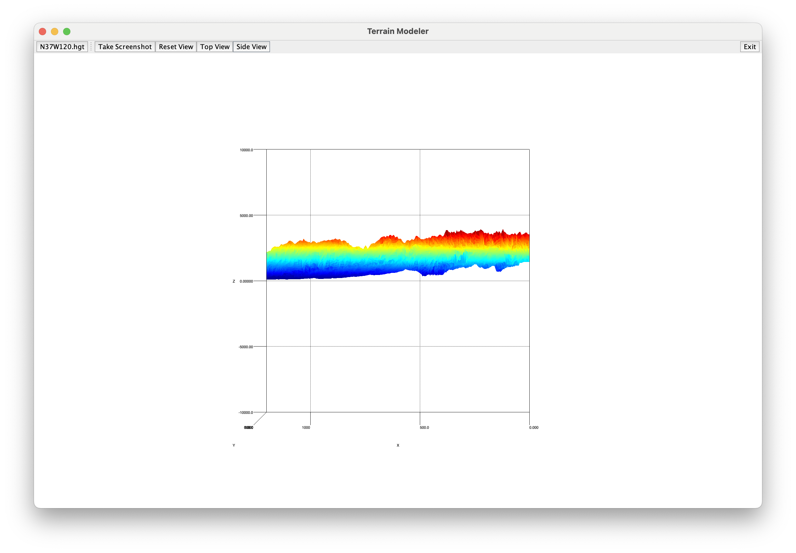

# TerrainModeler

Simple visualizer for satellite terrain data from the SRTMGL3 dataset. Uses Swing and Jzy3d graphics libraries.

### Run Instructions

Download the source code, enter the directory, run the code. Make sure you have the JDK installed. 

    git clone https://github.com/ryanfortner/TerrainModeler.git
    cd TerrainModeler
    ./gradlew run

### Included Data
Two sample data files are found in `resources/*.hgt`. You can use one of those as a sample, or [download from SRTMGL3](https://www.earthdata.nasa.gov/data/catalog/lpcloud-srtmgl3-003) (requires login).

### Screenshots

*Start window*

*Reset view*

*Top view*

*Side view*

### Credits
- [Jzy3d](http://www.jzy3d.org/)
- [This article](https://lo.calho.st/posts/printing-terrain-meshes/), for inspiration